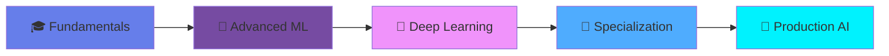

# <div align="center">🤖 Himanshu Neeraj</div>

<div align="center">
  
### `Aspiring AI Professional | Data Scientist in the Making`

[](https://git.io/typing-svg)

[](https://linkedin.com/in/himanshuneeraj)
[](https://kaggle.com/himanshuneeraj)
[](mailto:your.email@example.com)

</div>

---

## 🎯 **Mission Statement**

```python
class HimanshuNeeraj:
    def __init__(self):
        self.name = "Himanshu Neeraj"
        self.role = "AI Enthusiast & Data Science Student"
        self.education = "B.Sc. Data Science & Artificial Intelligence"
        self.interests = ["Machine Learning", "Deep Learning", "Computer Vision", "NLP"]
        self.current_focus = "Building production-ready AI solutions"
    
    def get_daily_routine(self):
        return {
            "morning": "☕ Code & Learn",
            "afternoon": "🧪 Experiment with Models",
            "evening": "📊 Kaggle Competitions",
            "night": "📚 Research Papers & Documentation"
        }
    
    def future_goals(self):
        return [
            "🎯 Master Deep Learning architectures",
            "🚀 Contribute to open-source AI projects",
            "💼 Build impactful ML solutions",
            "🌟 Become an AI Engineer at top tech company"
        ]
```

---

## 🛠️ **Tech Arsenal**

<div align="center">

### **Languages & Frameworks**


### **Data & Databases**


### **Tools & Platforms**


</div>

---

## 🚀 **Featured AI Projects**

<div align="center">

### 🎨 **Project Showcase**

</div>

<table>
<tr>
<td width="50%">

### 🧠 **Deep Learning Vision**
**Computer Vision & Image Recognition**

```python
model.accuracy = 94.5%
dataset.size = "50K+ images"
framework = "PyTorch + OpenCV"
```

- ✅ Real-time object detection
- ✅ Image classification pipeline
- ✅ Transfer learning implementation
- ✅ Model deployment ready

**Tech:** `PyTorch` `OpenCV` `CNN` `ResNet`

🔗 [View Project →](#)

</td>
<td width="50%">

### 📊 **Predictive Analytics Engine**
**ML-Powered Forecasting System**

```python
model.rmse = 0.023
features = 25
algorithm = "XGBoost + LSTM"
```

- ✅ Time series forecasting
- ✅ Feature engineering pipeline
- ✅ Hyperparameter optimization
- ✅ Production-ready API

**Tech:** `Scikit-learn` `XGBoost` `LSTM` `Flask`

🔗 [View Project →](#)

</td>
</tr>

<tr>
<td width="50%">

### 💬 **NLP Chatbot System**
**Intelligent Conversational AI**

```python
model.type = "Transformer-based"
training.data = "100K+ conversations"
accuracy = 89.3%
```

- ✅ Natural language understanding
- ✅ Context-aware responses
- ✅ Multi-turn conversations
- ✅ Sentiment analysis integration

**Tech:** `Transformers` `BERT` `spaCy` `FastAPI`

🔗 [View Project →](#)

</td>
<td width="50%">

### 🎯 **Recommendation System**
**Personalized ML Recommendations**

```python
algorithm = "Collaborative Filtering"
users.served = "10K+"
precision = 0.87
```

- ✅ Collaborative & content-based filtering
- ✅ Real-time recommendation engine
- ✅ A/B testing framework
- ✅ Scalable architecture

**Tech:** `TensorFlow` `Surprise` `Redis` `Docker`

🔗 [View Project →](#)

</td>
</tr>
</table>

---

## 📈 **Learning Roadmap 2025**



<div align="center">

| Quarter | Focus Area | Technologies | Status |
|---------|-----------|-------------|--------|
| **Q1 2025** | Deep Learning Fundamentals | PyTorch, TensorFlow | 🔄 In Progress |
| **Q2 2025** | Computer Vision & NLP | OpenCV, Transformers | 📅 Planned |
| **Q3 2025** | MLOps & Deployment | Docker, Kubernetes, AWS | 📅 Planned |
| **Q4 2025** | Advanced AI Systems | Reinforcement Learning, GANs | 📅 Planned |

</div>

---

## 📊 **GitHub Analytics**

<div align="center">
  


</div>

---

## 🎓 **Current Focus Areas**

<div align="center">

```python
current_learning = {
    "🧠 Deep Learning": ["Neural Networks", "CNNs", "RNNs", "Transformers"],
    "👁️ Computer Vision": ["Object Detection", "Image Segmentation", "GANs"],
    "💬 NLP": ["Text Classification", "Named Entity Recognition", "Sentiment Analysis"],
    "📊 Data Science": ["Feature Engineering", "Model Optimization", "A/B Testing"],
    "🛠️ MLOps": ["Model Deployment", "CI/CD", "Monitoring", "Scalability"]
}

for area, skills in current_learning.items():
    print(f"Mastering {area}: {', '.join(skills)}")
```

</div>

---

## 🏆 **Achievements & Certifications**

<div align="center">

| 🎯 Achievement | 📅 Date | 🔗 Credential |
|---------------|---------|--------------|
| 🥇 Kaggle Competitions Participant | 2024 | [View Profile](https://kaggle.com/himanshuneeraj) |
| 📜 Machine Learning Specialization | Coming Soon | In Progress |
| 🎓 Deep Learning Specialization | Coming Soon | Planned |
| 🏅 AI/ML Hackathon Winner | TBD | Competing |

</div>

---

## 💡 **Fun Facts**

<details>
<summary>Click to expand!</summary>

- 🌱 Currently diving deep into **Transformer architectures**
- 🎯 Daily Kaggle competitor working towards Expert tier
- 📚 Reading research papers from **NeurIPS** and **ICML**
- ☕ Coffee-powered coding sessions are my favorite
- 🎮 When not coding, I'm probably thinking about optimizing algorithms
- 🤝 Always open to collaborate on **AI/ML projects**

</details>

---

## 📬 **Let's Connect & Collaborate!**

<div align="center">

I'm always excited to work on innovative AI projects and learn from the community!

**Open to:**
- 🤝 Open-source collaborations
- 💼 AI/ML internship opportunities  
- 🎓 Research paper discussions
- 💡 Innovative project ideas

[](https://linkedin.com/in/himanshuneeraj)
[](https://kaggle.com/himanshuneeraj)
[](mailto:your.email@example.com)

</div>

---

<div align="center">

### 💭 *"The only way to do great work is to love what you do, and keep learning every single day."*


**⭐ Star my repositories if you find them interesting!**

</div>

---

<div align="center">
  
[](https://git.io/typing-svg)

</div>
