```mermaid
%%{init: {'theme':'dark'}}%%
graph LR
    A[🎓 ML Basics] -->|Mastered| B[🧮 Advanced ML]
    B -->|In Progress| C[🤖 Deep Learning]
    C -->|Next| D[👁️ Computer Vision]
    D -->|Upcoming| E[💬 NLP]
    E -->|Goal| F[🚀 Production AI]
    
    style A fill:#10b981
    style B fill:#06b6d4
    style C fill:#8b5cf6
    style D fill:#ec4899
    style E fill:#f59e0b
    style F fill:#ef4444
```

<div align="center">


[](https://git.io/typing-svg)


</div>

---

##  **NEURAL NETWORK INITIALIZATION...**

```python
class AIEngineer:
    def __init__(self):
        self.name = "Himanshu Neeraj"
        self.role = "AI Professional in Training"
        self.language_spoken = ["Python", "SQL", "Markdown"]
        self.education = "B.Sc. Data Science & AI"
        
    def say_hi(self):
        print("Thanks for dropping by! Let's build something intelligent together.")
        
    def current_status(self):
        return {
            "learning": ["Deep Learning", "Computer Vision", "NLP"],
            "working_on": "Advanced ML Projects",
            "collaborating_on": "Open Source AI",
            "fun_fact": "I debug code faster than I debug my life 😄"
        }

me = AIEngineer()
me.say_hi()
```

<div align="center">
  
### 🌐 **Connect With Me**

[](https://linkedin.com/in/himanshuneeraj)
[](https://kaggle.com/himanshuneeraj)
[](mailto:himanshuneeraj2917@gmail.com)
[](https://github.com/himanshu-neeraj)

</div>

---

##  **TECH STACK**

<div align="center">

### **Languages & Core Tools**


### **AI/ML Frameworks**


### **Databases & Tools**


</div>

---

##  **FEATURED AI PROJECTS**

<div align="center">

<a href="https://github.com/yourusername/project1">
  
</a>

<a href="https://github.com/yourusername/project2">
  
</a>

</div>

<br>

<table align="center">
<tr border="none">
<td width="50%" align="center">
  
  
  
  **🧠 Deep Learning Vision**
  
  Advanced CV system with 94.5% accuracy
  
  `PyTorch` • `OpenCV` • `CNN`
  
</td>

<td width="50%" align="center">

  
  
  **📊 Predictive Analytics**
  
  ML-powered forecasting with XGBoost
  
  `Scikit-learn` • `LSTM` • `Flask`
  
</td>
</tr>

<tr border="none">
<td width="50%" align="center">
  
  
  
  **💬 NLP Chatbot System**
  
  Intelligent conversation AI with BERT
  
  `Transformers` • `spaCy` • `FastAPI`
  
</td>

<td width="50%" align="center">

  
  
  **🎯 Recommendation Engine**
  
  Personalized ML recommendations
  
  `TensorFlow` • `Redis` • `Docker`
  
</td>
</tr>
</table>

---

##  **GIT STATS**

<div align="center">
   
  
  
</div>

<div align="center">
  
  
  
</div>

<div align="center">
  
</div>

---

##  **LEARNING JOURNEY 2025**

<div align="center">



</div>

<table align="center">
<tr>
<th>Phase</th>
<th>Focus Area</th>
<th>Technologies</th>
<th>Status</th>
</tr>
<tr>
<td><b>Q1 2025</b></td>
<td>Deep Learning Mastery</td>
<td><code>PyTorch</code> <code>TensorFlow</code></td>
<td>🔄 Active</td>
</tr>
<tr>
<td><b>Q2 2025</b></td>
<td>Computer Vision & NLP</td>
<td><code>OpenCV</code> <code>Transformers</code></td>
<td>📅 Planned</td>
</tr>
<tr>
<td><b>Q3 2025</b></td>
<td>MLOps & Deployment</td>
<td><code>Docker</code> <code>Kubernetes</code></td>
<td>📅 Planned</td>
</tr>
<tr>
<td><b>Q4 2025</b></td>
<td>Advanced AI Research</td>
<td><code>RL</code> <code>GANs</code></td>
<td>📅 Planned</td>
</tr>
</table>

---

## 🏆 **ACHIEVEMENTS & MILESTONES**

<div align="center">

[](https://github.com/ryo-ma/github-profile-trophy)

| Achievement | Status | Link |
|------------|--------|------|
| 🥇 Kaggle Competitions | Active | [Profile](https://kaggle.com/himanshuneeraj) |
| 📜 ML Certifications | In Progress | Coming Soon |
| 🎓 DL Specialization | Planned | 2025 |
| 🏅 AI Hackathons | Competing | TBD |

</div>

---

## 💡 **CURRENT FOCUS**

<div align="center">


</div>

```python
daily_routine = {
    "morning": ["☕ Coffee", "📚 Research Papers", "💻 Code Practice"],
    "afternoon": ["🧪 ML Experiments", "📊 Data Analysis", "🎯 Kaggle"],
    "evening": ["🚀 Project Building", "📖 Documentation", "🌟 Learning"],
    "night": ["💤 Rest", "🔄 Repeat Tomorrow"]
}

skills_upgrading = {
    "Deep Learning": ["Neural Networks", "CNNs", "RNNs", "Transformers"],
    "Computer Vision": ["Object Detection", "Image Segmentation", "GANs"],
    "NLP": ["Text Classification", "NER", "Sentiment Analysis"],
    "MLOps": ["Model Deployment", "Docker", "CI/CD", "Monitoring"]
}

print("🎯 Goal: Master AI & Build Impactful Solutions!")
```

---

## 🐍 **CONTRIBUTION SNAKE**

<div align="center">
  
<picture>
  <source media="(prefers-color-scheme: dark)" srcset="https://raw.githubusercontent.com/yourusername/yourusername/output/github-contribution-grid-snake-dark.svg">
  <source media="(prefers-color-scheme: light)" srcset="https://raw.githubusercontent.com/yourusername/yourusername/output/github-contribution-grid-snake.svg">
  
</picture>

</div>

---

## 📫 **LET'S COLLABORATE!**

<div align="center">


**I'm open to:**
- 🤝 Collaborating on AI/ML projects
- 💼 Internship opportunities
- 🎓 Research discussions
- 💡 Open source contributions

<a href="https://linkedin.com/in/himanshuneeraj">
  
</a>
<a href="https://kaggle.com/himanshuneeraj">
  
</a>
<a href="mailto:your.email@gmail.com">
  
</a>

</div>

---

<div align="center">

### 💭 *"Code is like humor. When you have to explain it, it's bad."* – Cory House


### ⭐ **Star my repos if you find them interesting!** ⭐

[](https://git.io/typing-svg)


</div>
